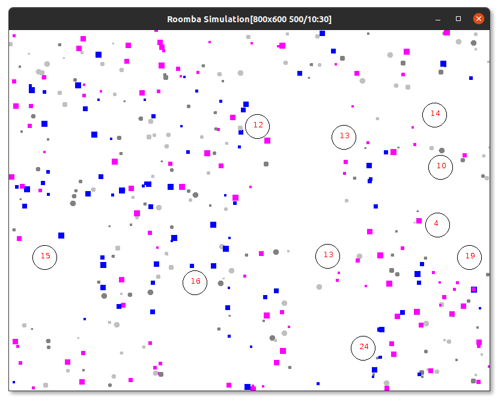

# Cleaning Simulation



This program is a simulation of cleaning. In a frame there are `cleaners` and many `dirts`. `Cleaners` (big circles) move and try to touch `dirts` (little particles). If they touch a dirt, then `numberOfDirtsCleaned` is incremented. Each `cleaner` saves own `numberOfDirtsCleaned` value.

There are two types of moves (move strategies):

- `MoveToDirtStrategy`. This strategy gives a cleaner ability to move to the closest dirt.

- `MoveRandomStrategy`. This strategy just shakes a cleaner.

Cleaners change their moving strategy after every `strategySteps` steps. The last variable is given as a command line argument

## Clone project

```bash
git clone https://github.com/zshanabek/cleaning_simulation
```

## Compile project

```bash
$ cd cleaning_simulation
$ javac SimulationRunner.java
$ java SimulationRunner
Usage: CleanSim <Width><Height><NumberOfDirts><NumberOfCleaners><StrategySteps>
```

## Run with command line arguments

```bash
java SimulationRunner 800 600 500 8 30
```
